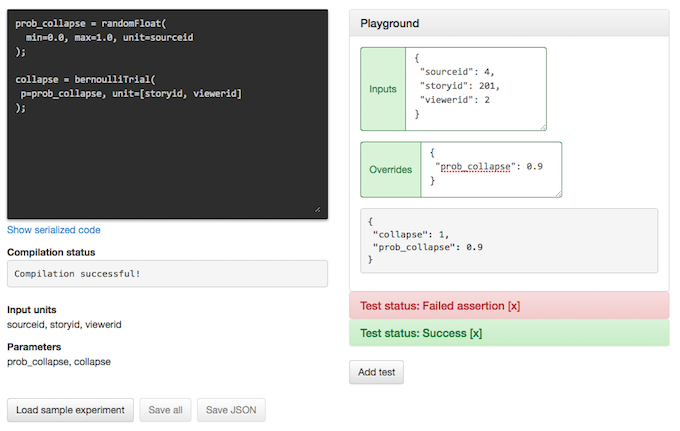

Earlier this year, we released a reference implementation of PlanOut
to provide a detailed blueprint for how we
[design and deploy complex online experiments](http://arxiv.org/pdf/1409.3174v1.pdf) and make it easy for first-time experimenters to get up and running.
This framework was designed from scratch so that any PlanOut experiment could be written entirely in Python.

When we first started developing PlanOut, we intended for it to be a
programming language optimized for designing experiments.
Instead of writing error-prone, difficult-to-test hashing procedures
in PHP, we could instead express our designs in terms of a
language that is natural enough to work with on a whiteboard or include in an academic paper.  This language would then be compiled down into a serialized format that could later be executed by an interpreter.

Today, we are officially announcing the release of PlanOut 0.5, which includes
a PlanOut language editor, and brings the interpreter into
feature-parity with the latest version of PlanOut we use internally at Facebook. This
includes tighter integration with the `Experiment` classes, a safer runtime
environment, improved support for testing experiments, the ability to
programmatically disable logging, and a rewrite of the interpreter that makes it
easier to port to other languages, including strongly-typed languages.

## Why a new language? ##
There are many advantages of having a language and interpreter for online experiments.  These aspects include:

*Bridging the gap between ideation and implementation*. By having our own language, we can have a sort of lingua franca
for describing experiments that is accessible not only to engineers, but also to researchers, data scientists, and managers.
In fact, this language is so parsimonious that many of us on the Facebook Data Science team often whiteboard out experimental designs in PlanOut code during brainstorming sessions and meetings.

*Safe execution*. Representing experiments in terms of a language with a [limited
number of operations](planout-language-reference.html) makes it much less likely that one makes a mistake.
PlanOut has a very primitive syntax, no computationally expensive built-in functions, nor does not allow
developers to define their own functions ([at least, within the script itself](creating-new-operators.html)), use loops, or make arbitrary calls to
functions that could behave in an erratic way.  In this way, PlanOut scripts are
safe, and when they do have problems, there are a limited number of ways things
could go wrong.  And because PlanOut is so basic, the interpreter is easy to port to other languages.


*Serializable*. The real power of the PlanOut language is that it can be compiled into a JSON-representation that can read by a simple, portable interpreter.  This part is key to scaling experimentation.

For example, the following PlanOut language experiment,

```python
button_text = uniformChoice(choices=['Purchase', 'Buy'], unit=userid);
has_discount = bernoulliTrial(p=0.3, unit=userid);
```

can be compiled down to the following JSON blob:

```json
{
  "op": "seq",
  "seq": [
    {
      "op": "set",
      "var": "button_text",
      "value": {
        "choices": {
          "op": "array",
          "values": [
            "Purchase",
            "Buy"
          ]
        },
        "unit": {
          "op": "get",
          "var": "userid"
        },
        "op": "uniformChoice"
      }
    },
    {
      "op": "set",
      "var": "has_discount",
      "value": {
        "p": 0.3,
        "unit": {
          "op": "get",
          "var": "userid"
        },
        "op": "bernoulliTrial"
      }
    }
  ]
}
```

This code can then be stored in a centralized system that manages simultaneous and follow-on experiments (e.g., via [namespaces](namespaces.html)), and executed on multiple platforms.

*Developer friendly*. Serialized PlanOut code is easy to parse, making it possible to infer which variables are inputs, and which parameters rely on external services.  This makes it possible to construct highly interactive editors that know about how you'd like to test out your code.  And because PlanOut runs under an interpreter, it is possible to "freeze" (override) certain parameter values to do testing. This allows you to test complex experimental designs without having to enter in random userids until you find the right combination that triggers the designed logic.


## PlanOut Editor ##
PlanOut 0.5 includes a [PlanOut editor](http://planout-editor.herokuapp.com), built on [React](https://facebook.github.io/react/) and [Flux](https://facebook.github.io/flux/). The PlanOut editor lets you
interactively write PlanOut scripts and immediately see what your experiment is
doing.  As you type, you fill find that undefined variables appear as inputs in
the tester panel on the right hand side.  Developers can modify the values of
these input variables within a Playground, and immediately see how these units
get mapped to parameters.  Playgrounds also give you the ability to test your
code through the use of [overrides](testing.html), which "freeze" parameters so
that they do not change during the execution of your script.




The screenshot above shows a hypothetical experiment that assigns `sourceids` to
a random number between 0.0 and 1.0, and stores that value in the parameter,
`prob_collapse`.  This parameter is then read in by the next line, does a
[Bernoulli trial](random-operators.html) which sets `collapse` to 1 with probability
`prob_collapse`, and 0 otherwise.  By setting `prob_collapse` in the override to
a high value like 0.9, the developer can see for herself that inputs are more
likely to map to a `collapse` value of 1.

Finally, because PlanOut scripts can be used to launch live experiments, we
have built in the ability to add [unit tests](http://en.wikipedia.org/wiki/Unit_testing).  These work by letting users enter inputs, overrides, and list assertions about what parameters are expected to be assigned to what values.  This ensures that the experiment executes as expected, and that any changes to an experiments' definition do not result in breaking the expected randomization.   Because overrides maintain their value throughout the execution, they can act as
a sort of [mock](http://en.wikipedia.org/wiki/Test-driven_development#Fakes.2C_mocks_and_integration_tests)
in cases where your experiment depends on a [custom operator](creating-new-operators.html) that interfaces with
an external service.

The PlanOut editor is available as part of the [PlanOut Github repository](http://facebook.github.io/planout/), and we encourage developers to fork it or contribute changes.  Ports of PlanOut to [Go](https://github.com/URXtech/planout-golang), PHP, and Hack will be available in early 2015. If you are interested in porting PlanOut to other languages, please feel free to reach out to us.
