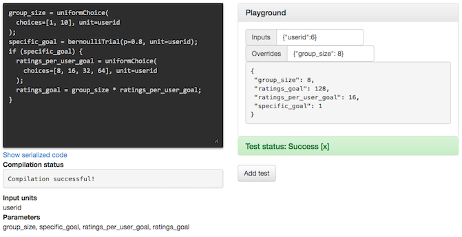

One challenge of developing complex randomized experiments is that they
can be difficult to test. This is especially apparent when assignment procedures
involve probabilities and conditional assignment.

PlanOut simplifies the testing process by letting you "freeze" the value of a variable
so that it does not change during the execution of your assignment procedure.
This lets you test different user experiences generated by your experiment
without having to modify your experiment definition.

## A difficult-to-test experiment
Consider an experiment that examines [social loafing and goal-setting](http://repository.cmu.edu/cgi/viewcontent.cgi?article=1087&context=hcii) on [MovieLens](http://en.wikipedia.org/wiki/MovieLens).
Their experiment first randomly assigns participants to different group sizes,
and then randomizes them into to receiving either a general or specific goal.
If a participant is assigned to a specific goal, they are assigned to a number
of target ratings, expressed in terms of ratings per user, for each group size.


```python
class MotivationExperiment(SimpleExperiment):
  def assign(self, params, userid):
    params.group_size = UniformChoice(choices=[1, 10], unit=userid)
    params.specific_goal = BernoulliTrial(p=0.8, unit=userid)
    if params.specific_goal:
      params.ratings_per_user_goal = UniformChoice(
        choices=[8, 16, 32, 64], unit=userid)
      params.ratings_goal = params.group_size * params.ratings_per_user_goal
```


## Testing using the Python API

Let's walk through how we would go about testing the experiment in Python.
First, let's see how a `userid` gets mapped to parameters.

```python
e = MotivationExperiment(userid=6)
print e.get_params()
```

which then outputs,

```
{'group_size': 10, 'specific_goal': 0}
```

Here, we can see that `userid` 6 gets assigned to a group size of 10 and does
not receive a specific goal.

What if we wanted to test the code that gets evaluated when `specific_goal` is
true? Instead of going through a trial-and-error process of picking random
userids and hoping that one of them will receive a specific goal, we could
simply specify an override that sets `specific_goal` to `1`. This way, as
the code executes, the `specific_goal` will maintain this value.

```python
e = MotivationExperiment(userid=6)
e.set_overrides({'specific_goal': 1})
print e.get_params()
```

With this override, we can now observe the downstream behavior of the script when `specific_goal` is set to `1`:

```
{'specific_goal': 1, 'ratings_goal': 640, 'group_size': 10, 'ratings_per_user_goal': 64}
```

Any number of parameter can be overridden. For example,

```python
e = MotivationExperiment(userid=6)
e.set_overrides({'specific_goal': 1, 'ratings_per_user_goal': 16})
print e.get_params()
```

yields,

```
{'specific_goal': 1, 'ratings_goal': 160, 'group_size': 10, 'ratings_per_user_goal': 16}
```

## Testing with the PlanOut editor
The experiment can be expressed in the
[PlanOut language](interpreter.html) as:

```javascript
group_size = uniformChoice(choices=[1, 10], unit=userid);
specific_goal = bernoulliTrial(p=0.8, unit=userid);
if (specific_goal) {
  ratings_per_user_goal = uniformChoice(choices=[8, 16, 32, 64], unit=userid);
  ratings_goal = group_size * ratings_per_user_goal;
}
```

Overrides are one of the main ways to interact with a PlanOut script when using
the [PlanOut editor](https://github.com/facebook/planout/tree/master/planout-editor).
One can test the effect of different overrides by inputting in a JSON-formatted dictionary
of overrides into the Playground unit on the left-hand side of the editor.




## Integrating with a live site
A simple way to test a live Web application using PlanOut is to pass overrides
into your endpoint as a query parameter, e.g.,

```
http://my.site/home.php?overrides=specific_goal:1,ratings_goal:16
```
