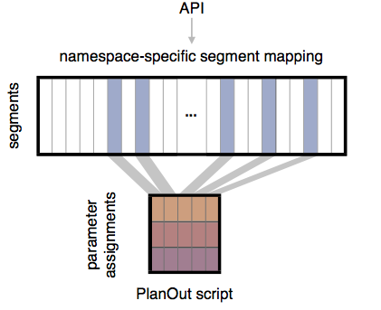

Namespaces are used to manage related experiments that manipulate the same parameter. These experiments might be run sequentially (over time) or in parallel. Namespaces can be used to keep experiments "exclusive" or "non-overlapping".

Namespaces are models similar to
[Google's "layers"](http://research.google.com/pubs/pub36500.html),
[Microsoft's "line numbers"](http://www.exp-platform.com/Documents/2013%20controlledExperimentsAtScale.pdf)
and Facebook's "universes", which solve the overlapping experiment problem by
centering experiments around a *primary unit*, such as user IDs.
Within a given namespace, each primary unit belongs to at most one experiment.

### How do namespaces work?
Rather than requesting a parameter from an experiment, developers request a
parameter from a namespace, which then handles identifying the experiment
that that unit is part of, if there is is an experiment that the primary unit
belongs to. From a developer's point of view, parameters are requested and logged
using namespaces exactly as one would using experiments (at least via the
`SimpleExperiment` and `SimpleNamespace` classes).

Under the hood, primary units are mapped to one of a large number of segments
(e.g., 10,000).
Segments are randomly allocated to experiments when a new experiment is created.
For any given unit, a namespace manager looks up that unit's segment.
If the segment is allocated to an experiment, the input data is passed to the experiment,
and random assignment occurs using the regular logic of the corresponding `Experiment` object.

If the primary unit is not mapped to an experiment, or a parameter is requested that is not defined by the experiment, a default experiment or value may be used.
 This allows experimenters to configure default values for parameters on the fly in a way that does not interfere with currently running experiments.

### When do I need to use a namespace?
Namespaces are useful whenever there is at least one variable in your code
base that you would like to experiment with, over time or simultaneously.

As a starting point, PlanOut provides a basic implementation of namespaces with the `SimpleNamespace` class, which is outlined in the next page.
